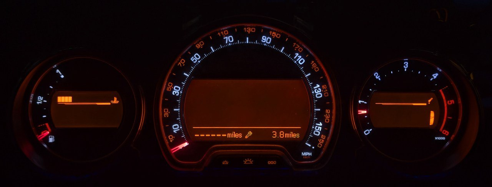

# Citroen C5 II

- Manufacturer: Citroen
- Model: C5 II
- Years: 2008 - 2017
- Part number: 9665557680

## Wiring

- Pin 1: +12V
- Pin 3: GND
- Pin 2: CAN High
- Pin 4: CAN Low

## Working

- Ignition on/off
- Check oil messages
- RPM gauge
- Speedometer
- Engine coolant temperature gauge
- Trip odometer
- Gear indicator (manual/automatic + sport/winter mode)
- Lamp light indicators (turn signals, high beam, etc.)
- Warning lights (seat belts, ABS, ESP, etc.)

## Issues

- Speed in display not being shown

## Not working

- Fuel gauge
- Odometer
- Service interval
- Engine oil temperature
- Cruise control info
- Trip computer info
- Informational messages
