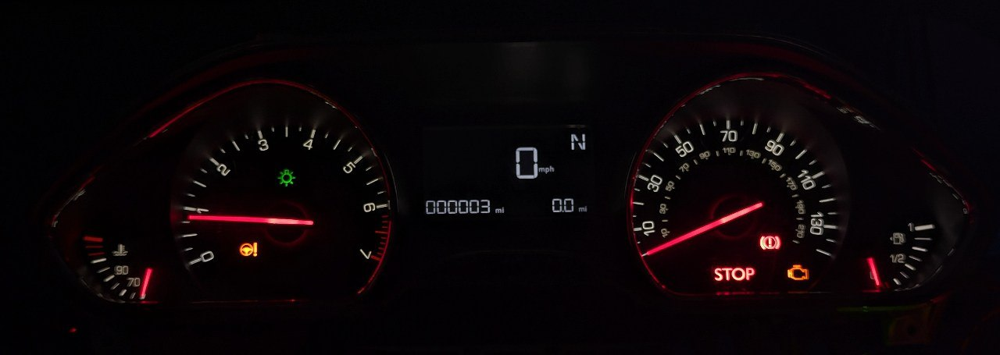

# Peugeot 208 I

- Manufacturer: Peugeot
- Model: 208 I
- Years: 2012 - 2019
- Part number: 9801906680

## Wiring

- Pin 10: +12V
- Pin 15: GND
- Pin 7: CAN High
- Pin 9: CAN Low

## Working

- Ignition on/off
- Check oil messages
- RPM gauge
- Speedometer (including speed in display)
- Engine coolant temperature gauge
- Odometer
- Trip odometer
- Service interval
- Gear indicator (manual/automatic + sport/winter mode)
- Lamp light indicators (turn signals, high beam, etc.)
- Warning lights (seat belts, ABS, ESP, etc.)
- Exotic display icons (press brake pedal, press clutch pedal, etc.)

## Issues

- Check engine light, parking brake light and "STOP" light turns on after ignition on

## Not working

- Fuel gauge
- Cruise control info
- Trip computer info (no idea if they can be displayed on the cluster)
